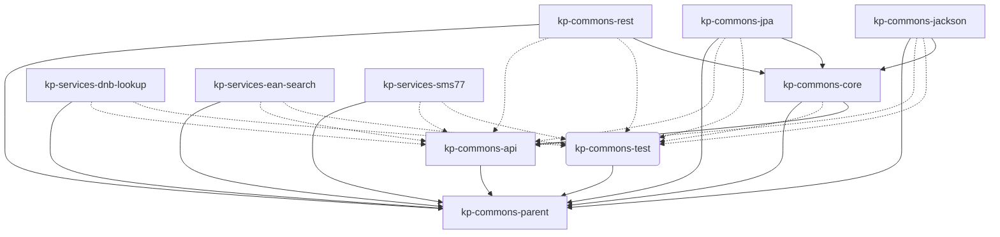

## 3.2 Technical Context

*Technical context of all public components of the KP-COMMONS.*

-----

| Komponente | Nutzung |
|------------|---------|
| kp-commons-api | Central API for all modules |
| kp-commons-core | The generic implementation of all central library components. |
| kp-commons-test | Helpers for tests. |
| kp-commons-jackson | Json/Xml handling. |
| kp-commons-jpa | Handling JPA based databases. |
| kp-commons-rest | REST handling. |
| kp-services-dnb-lookup | Lookup of publications in the DNB. |
| kp-services-ean-search | Lookup of EAN numbers. This is a service to a paid service. |
| kp-services-sms77 | Sending of SMS via a paid service provided by https://seven.io. |
