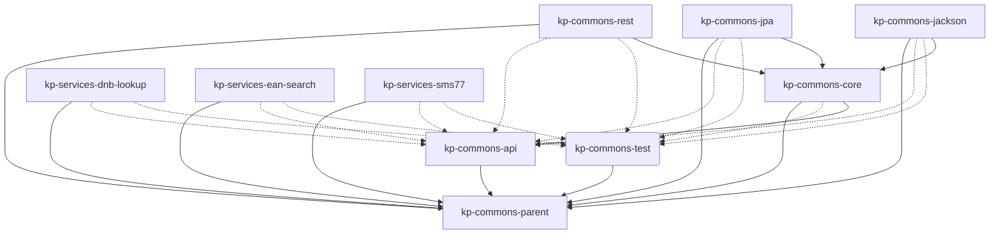

KP-COMMONS consists of several sub modules. 

DokChess zerfällt wie in Bild unten dargestellt in vier Subsysteme. Die gestrichelten Pfeile stellen fachliche Abhängigkeiten der Subsysteme untereinander dar ("x -> y" für "x ist abhängig von y"). Die Kästchen auf der Membran des Systems sind Interaktionspunkte mit Außenstehenden
([→ 3.2 Kontextabgrenzung](/03_kontextabgrenzung/02_technischer_kontext/)).

*Graph 5.1: Technical context of all public components of the KP-COMMONS.*

-----

| Subsystem | Usage |
|------------|---------|
| [kp-commons-api](/07_deployment/01_core/) | Central API for all modules |
| [kp-commons-core](/07_deployment/01_core/) | The generic implementation of all central library components. |
| [kp-commons-test](/07_deployment/01_core/) | Helpers for tests. |
| [kp-commons-jackson](/07_deployment/02_modules/) | Json/Xml handling. |
| [kp-commons-jpa](/07_deployment/02_modules/) | Handling JPA based databases. |
| [kp-commons-rest](/07_deployment/02_modules/) | REST handling. |
| [kp-services-dnb-lookup](/07_deployment/03_dnblookup/) | Lookup of publications in the DNB. |
| [kp-services-ean-search](/07_deployment/04_eansearch/) | Lookup of EAN numbers. This is a service to a paid service. |
| [kp-services-sms77](/07_deployment/05_sms/) | Sending of SMS via a paid service provided by https://seven.io. |

*Table: Overview of the sub systems.*
