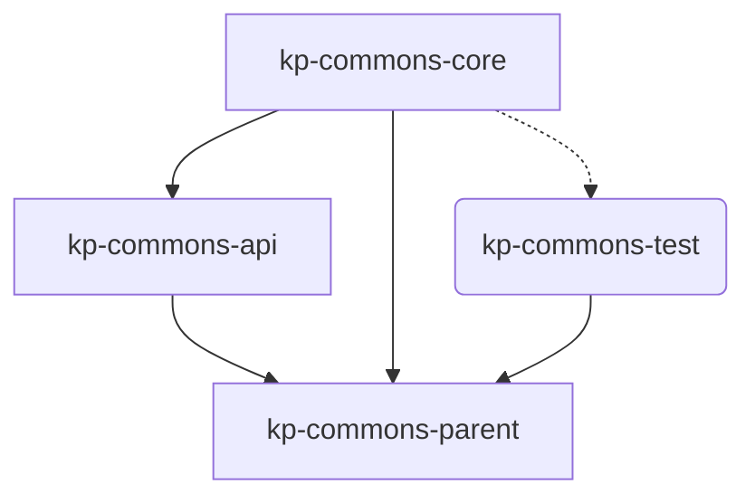

The core of KP-COMMONS consists of the API for **all** submodules of KP-COMMONS (including the [→ modules](/05_buildingblocks/02_2_modules/) and the [→ services](/05_buildingblocks/02_3_services).
And just as the modules and services they rely on the [→ internals](/05_buildingblocks/02_4_internals).

*Graph: Technical context of all core components of the KP-COMMONS.*

## API (kp-commons-api) {#API}

## Core (kp-commons-core) {#CORE}

## Test (kp-commons-test) {#TEST}
