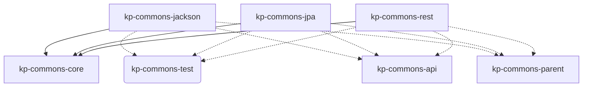

The core of KP-COMMONS consists of the API for **all** submodules of KP-COMMONS (including the [→ modules](/05_buildingblocks/02_2_modules/) and the [→ services](/05_buildingblocks/02_3_services).
And just as the modules and services they rely on the [→ internals](/05_buildingblocks/02_4_internals).

*Graph: Dependencies between the modules and core libraries.*

## Json and XML Handling (kp-commons-jackson)

## Database Handling (kp-commons-jpa)

## REST Interface Handling (kp-commons-test)