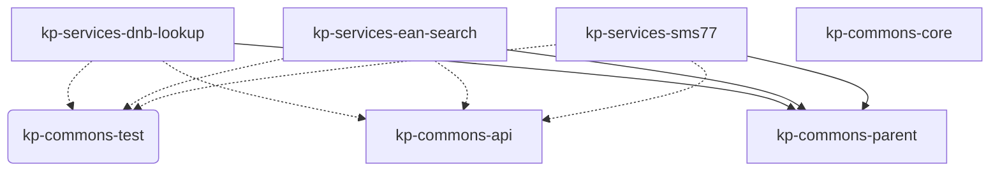

The services rely on the [→ core libraries](/05_buildingblocks/02_1_core/).

*Graph: Dependencies between the modules and core libraries.*

## Print Publication Lookup via DNB (kp-commons-dnb-lookup)

## EAN lookup via Relaxed Communications GmbH (kp-commons-ean-search)

## Sending SMS via Seven.io (kp-commons-sms77)
