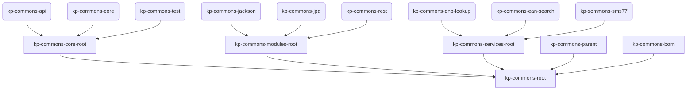

The internals provide the maven parent and bom (bill of materials) for all other submodules.
In addition we consider the maven build system technicalities (like the root poms as glue to the published modules) as part of the internals.

*Graph: Technical context of all internal components of the KP-COMMONS.*

## Core Root (kp-commons-core-root)

## Modules Root (kp-commons-modules-root)

## Services Root (kp-commons-services-root)

## Parent (kp-commons-parent)

## Bill of Material (kp-commons-bom)

## Root (kp-commons-root)