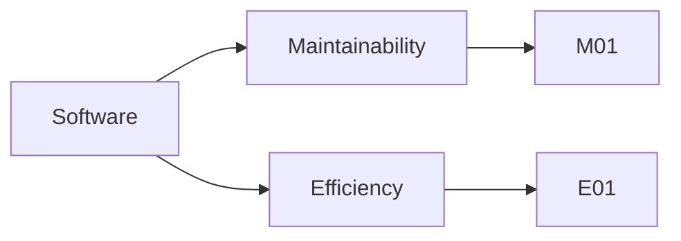

The following tree is an overview over the quality requirements (non functional requirements) of the software.
The requirements are listed in [→ Quality Scenarios]().
The functional requireements are listed in [→ Requirements]().

*Graph: Strucutre of the quality requirements of the software.*