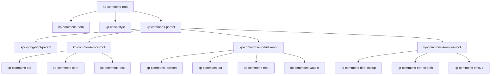

# Building Block View

## Scope and Context

| Name  | Responsibility |
| :---- | :------------- |
| [kp-checkstyle](./kp-checkstyle/index.html) | The checkstyle definition for the Kaiserpfalz EDV-Service. |
| [kp-commons-parent](./kp-commons-parent/index.html) | The parent for the Kaiserpfalz EDV-Service libraries. |
| [kp-spring-boot-parent](./kp-commons-parent/kp-spring-boot-parent/index.html) | The spring-boot parent for the Kaiserpfalz EDV-Service spring-boot services. |
| [kp-commons-api](./kp-commons-parent/kp-commons-core-root/kp-commons-api/index.html) | API for the core and module libraries. |
| [kp-commons-core](./kp-commons-parent/kp-commons-core-root/kp-commons-core/index.html) | Core library with common features. |
| [kp-commons-test](./kp-commons-parent/kp-commons-core-root/kp-commons-test/index.html) | Handling tests. |
| [kp-commons-jackson](./kp-commons-parent/kp-commons-modules-root/kp-commons-jackson/index.html) | Handling serialization and deserialization for json and XML. |
| [kp-commons-jpa](./kp-commons-parent/kp-commons-modules-root/kp-commons-jpa/index.html) | Handling persistence with JPA. |
| [kp-commons-rest](./kp-commons-parent/kp-commons-modules-root/kp-commons-rest/index.html) | Handling REST requests. |
| [kp-commons-vaadin](./kp-commons-parent/kp-commons-modules-root/kp-commons-vaadin/index.html) | Vaadin common modules and widgets. |
| [kp-commons-dnb-lookup](./kp-commons-parent/kp-commons-services-root/kp-commons-dnb-lookup/index.html) | Lookup of books via the service of the [Deutsche Nationalbibliothek (DNB)](https://www.dnb.de/EN/Benutzung/Katalog/katalogDNB_node.html). |
| [kp-commons-ean-search](./kp-commons-parent/kp-commons-services-root/kp-commons-ean-search/index.html) | Lookup of EAN numbers with the service of [EAN Search](https://ean-search.org). |
| [kp-commons-sms77](./kp-commons-parent/kp-commons-services-root/kp-commons-sms77/index.html) | Sending SMS messages via the service of [Seven.io](https://seven.io) (formerly SMS77). |
| kp-commons-root [kp-commons-core-root](./kp-commons-parent/kp-commons-core-root/index.html) [kp-commons-modules-root](./kp-commons-parent/kp-commons-modules-root/index.html) [kp-commons-services-root](./kp-commons-parent/kp-commons-services-root/index.html) | Maven multi module projects for managing the kp-commons. |
