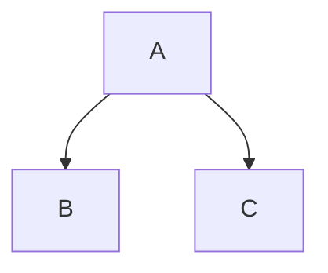

# Building Block View

## Scope and Context

## Level 1

* core
  * kp-commons-api
  * kp-commons-core
  * kp-commons-test
  * (kp-commons-bom)
  * (kp-commons-parent)
* modules
  * kp-commons-jpa
  * kp-commons-rest
  * (kp-commons-vaadin - WIP)
* services
  * kp-commons-ean-search
  * kp-commons-sms77
  * kp-commons-dnb-lookup

|------|----------------|
| Name | Responsibility |

### Black Box 1

### Black Box 2
