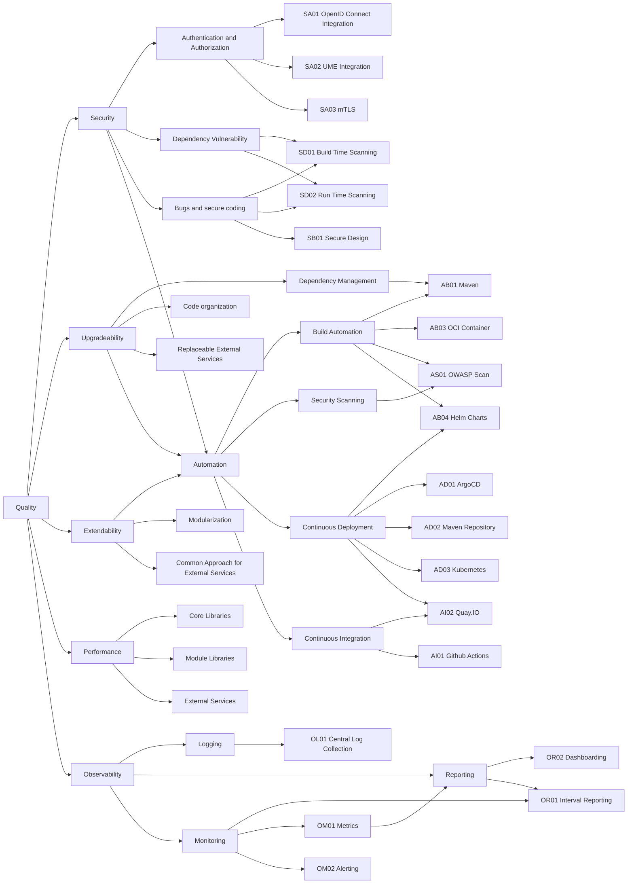

# Quality

## Quality Requirements

| ID    | Description |
| :---- | :---------- |
| AB01 | Maven. Build automation via Maven to build all Java Artifacts. |
| AB03 | OCI-Container. Executable services are delivered as OCI-Container plus Helm charts (AB04). |
| AB04 | Helm. Executable services are delivered as OCI-Container (AB03) plus Helm Charts. |
| AD01 | ArgoCD. Active service components are delivered to service via ArgoCD. |
| AD02 | Maven Repository. Java Artifacts are delivered via a maven repository. |
| AD03 | Kubernetes. Active Services are provided via kubernetes are runtime environment. |
| AI01 | Github Actions. The build is automated on Github via GH actions. |
| AI02 | Quay.IO. Containers and Helm Charts are provided via the container registry quay.io |
| AS01 | OWASP-Scan. During build an OWASP based security scan and report is delivered. |
| OM01 | Metrics are collected via a central metric harvesting. |
| OM02 | Alerting is based on metric collection provided by OM01. |
| OR01 | Interval Reporting. |
| OR02 | Dashboarding. |
| SA01 | OpenID Connect is used for network based user authentication |
| SA02 | UME is used for managing user provided content with a permission management. |
| SA03 | mTLS is used for service to service authentication. |
| SB01 | Secure Design is the basis for providing secure software. |
| SD01 | Build Time Scanning. |
| SD02 | Run Time Scanning. |

## Quality Scenarios
